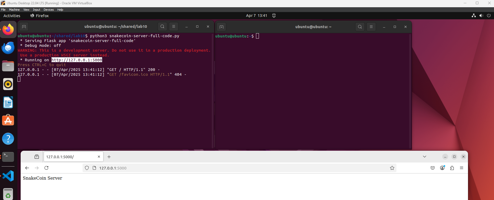

# Lab 10 - Blockchain
The goal of thsi lab was develop a small understanding of what a [blockchain](https://builtin.com/blockchain) is and what is does.

## Running [hash_value.py](hash_value.py)
```hash_value.py```
```sh
$ python3 hash_value.py 
The hash for 1 is: 1
The hash for 1.0 is: 1
The hash for 3.14 is: 322818021289917443
The hash for Python is: -3658605231677136172
The hash for a tuple of vowels is: 6634240488416654919
The hash for an object of person is: -1736793660343577204
$ python3 hash_value.py 
The hash for 1 is: 1
The hash for 1.0 is: 1
The hash for 3.14 is: 322818021289917443
The hash for Python is: 1250882236976261216
The hash for a tuple of vowels is: -744796290371315810
The hash for an object of person is: -1696202671233263224
```
As can be seen in the two [hash values](https://cyberpedia.reasonlabs.com/EN/hash%20value.html), they are different, even when running the same program twice. This is to be expected because a hash value is like a digital fingerprint.

## Running [snakecoin.py](snakecoin.py)
```snakecoin.py```
```sh
$ python3 snakecoin.py
Block #1 has been added to the blockchain!
Hash: f064cbf200a37dbbeb773c7a52f09be5db867d1a756ffbf8aebd5cef5ca851c5

Block #2 has been added to the blockchain!
Hash: c742593b28926dd3ecedf619263d16c3b9582f57d7ced219a799880b7bd33a74

Block #3 has been added to the blockchain!
Hash: 3f59698460c040870933df84fae06714d6276d53dca6f2570c2d8f1ad32d88a3

Block #4 has been added to the blockchain!
Hash: 96cc87e491037673699ad53b666a3468df8ab1b6c8d363a6ac3d543df1871e2c

Block #5 has been added to the blockchain!
Hash: 0191cd12985f2fb2922f18d20ba11e9080eef1ea6a9db16b25100c4fa53890d1

Block #6 has been added to the blockchain!
Hash: ded863eaa2ef38e5ca33ba6b2cc76098f7078604230dee87a49df527c4ed86ff

Block #7 has been added to the blockchain!
Hash: 858399ebbe5bbd4a715fb9abe163af896c7ec438dd1b2b23308bdce35d971bf8

Block #8 has been added to the blockchain!
Hash: cfff769f1fcbed3e0362dc4c2a7cd6f24213917f13416c7129f5250cb00cb1a3

Block #9 has been added to the blockchain!
Hash: 74570b63bf92aae7fc799257eae890047197355d1f18544134faa2bd7ad85337

Block #10 has been added to the blockchain!
Hash: 1070c3d875091282eb91537e1d664c8220637025fa9338d035439838d0d3a1d7

Block #11 has been added to the blockchain!
Hash: 7c5c05b18fbca1cff40a9ff3d92ce7bea122df2c7d217f6c5b5f85510856b481

Block #12 has been added to the blockchain!
Hash: 7bbc12ee446ed4db00b64768b51c8bfc7ae47c9f7aee7c219500721ed786e2ad

Block #13 has been added to the blockchain!
Hash: 2bc58a22459dde7543f1a87d67d1939671a17de5d0d00dadb40bfb2f2bbc3293

Block #14 has been added to the blockchain!
Hash: 6b0691a814a853951c84c0087752e09b3a2c852f731bdd8b091b56ee7e126627

Block #15 has been added to the blockchain!
Hash: 2de036ef6d58021b1fc659593d4c420d975559cc603e9c24baca3cd8f5ca4467

Block #16 has been added to the blockchain!
Hash: ff9432eab381c26ba680f815eff3fd45d12682fdd2627ed90c128b4223438035

Block #17 has been added to the blockchain!
Hash: bc7533a8cb6c2492bf180482b795a947a0b8321cf77fb79267e90ea9274616dd

Block #18 has been added to the blockchain!
Hash: 891d0b48824c7d58e09c20b4183f046b487ed3bcb4cc0da2b0e9d32b4d53d957

Block #19 has been added to the blockchain!
Hash: c0b7dbb7cdce716b4739c374084b4a20058047a1f0d6c021d6ec202bc7c4bbcb

Block #20 has been added to the blockchain!
Hash: bb882c261cf0f51e1a3589dd4d9c27a314485b490bf29664c040f86a227e4b50
```

## Running a snakecoin server with [snakecoin-server-full-code.py](snakecoin-server-full-code.py)


### After Mining the Transaction


## Python Blockchain App
This is another demonstration of how the blockchain works. In this section, we deployed a server and then mined the data that was present there.

### Running the Server


### Mining Confirmation


### Post Mined on Site


### Final Server Output


