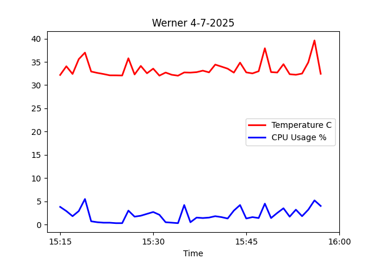
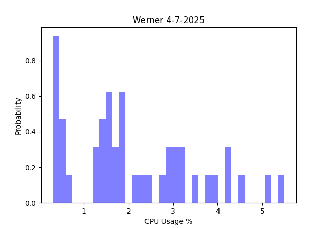
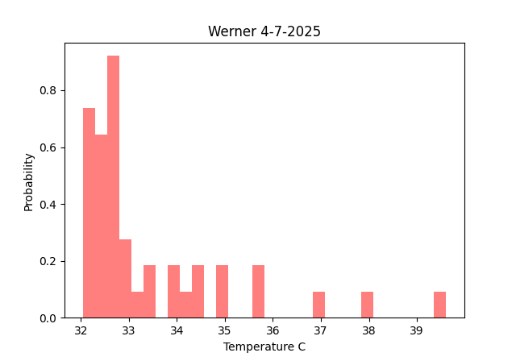
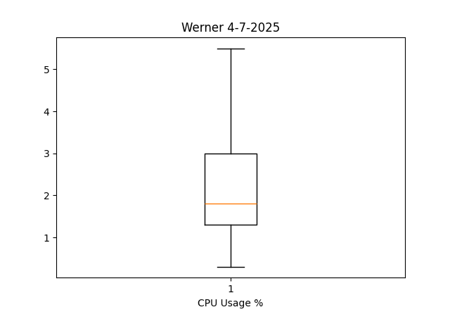
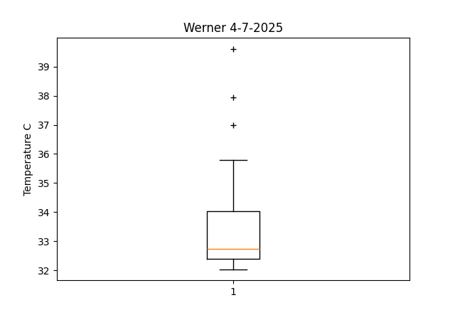
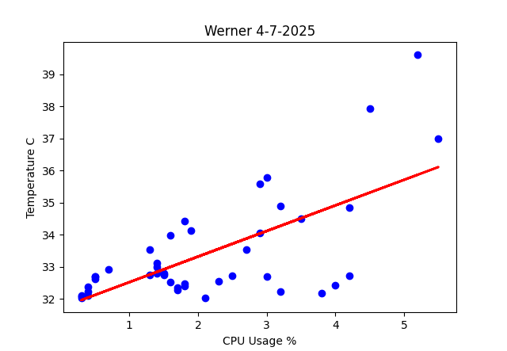
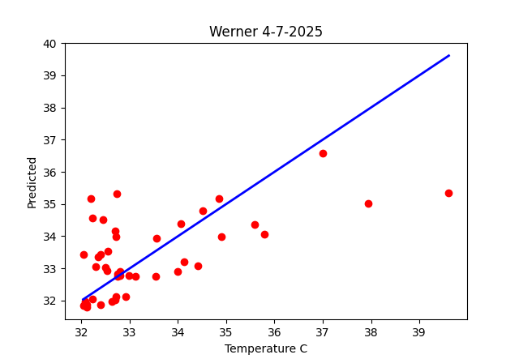

# Lab 8 - Data Analysis
In this Lab, we used data analysis tools to plot the files in [Lab 7](lab7). For this lab, since I did not receive any CPU temperature data, and after re-running the software, I have still not received any results.
Therefore, I developed a formula to simulate the temperature shift in Excel to have at least some data to plot for this lab. Below are all the graphs that were generated from the data.

## [plt_final.py](plt_final.py)

### pl_finalplot1

### pl_finalplot2

### pl_finalplot3

### pl_finalplot4

### pl_finalplot5

### pl_finalplot6

## [plt_cv2.py](plt_cv2.py)

### plt_cv2fig1

