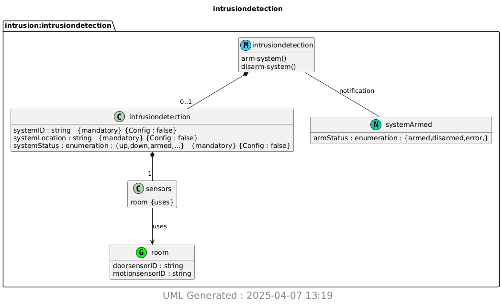

# Lab 9 - YANG
In this lab, we used the [Yang](https://github.com/mbj4668/pyang) to generate a [UML](https://www.geeksforgeeks.org/unified-modeling-language-uml-introduction/) diagram automatically.

## Downloading Software
```Pyang and plantum1 install```
```sh
$ sudo pip3 install pyang plantuml
```

## Making the UML File

```Making UML file```
```sh
$ pyang -f yin -o intrusiondetection.yin intrusiondetection.yang
$ pyang -f uml -o intrusiondetection.uml intrusiondetection.yang --uml-no=stereotypes,annotation,typedef
$ python3 -m plantuml intrusiondetection.uml
[{'filename': 'intrusiondetection.uml', 'gen_success': True}]
```
This will create a .png file that will hold the UML design.

## intrusiondectection.png

